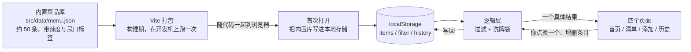

# 「想吃啥」技术设计文档（TECH_DESIGN）

> **版本**：v1.0（Day 5）
> **依据**：本仓库的 `PRD.md`（v2.1，41 条验收标准）
> **作者**：黄闰南
> **本文不涉及**：任何代码实现（Day 6–7 的事）；对 PRD 的修改

---

## 0. 一句话回答今天的掌握问题

> **内置菜品库跟着代码一起打包进前端（构建时就在浏览器里）→ 你的增删改和过滤设置写进浏览器本地存储 → 历史记录同样只落在本机。**
> **全程不出这台电脑，没有第二个地方。**

今天的全部工作，就是把这个链条画成图、拆成表和接口，让你能指着它说清每一段。

## 版本历史

| 版本 | 改了什么 |
|---|---|
| v1.0 | 初稿（Day 5）：三套路线比较 → 推荐「纯前端 + 本地存储」；含项目结构、数据模型、接口清单、数据流图、错误处理、环境变量、迁移注意事项 |

---

## 1. 约束：技术选型的边界从哪来

**技术不是先选再找理由，而是被 PRD 的条款逼出来的。** 先把约束摆齐，后面每一条选择都要对得上这里。

| # | 约束 | 来自 | 对技术的含义 |
|---|---|---|---|
| 约束 1 | 页面上**不存在**登录 / 注册入口 | PRD **G1** | 服务器端**拿不到"你是谁"** → 本期不该有服务器，否则数据无处归属 |
| 约束 2 | 打开到出现结果 **≤ 3 秒** | PRD **A2** | 关键路径不能依赖网络往返；本地读取优先 |
| 约束 3 | 存储不可用时**降级为内存态**并提示一次 | PRD **E3** / §5.3 | 数据层必须有"可用性探测 + 降级分支"，且这个分支只能写在一个地方 |
| 约束 4 | 必须能**不经过首页**直接进入「历史记录」页 | PRD **J3** | 需要**可寻址的路由**（有 URL），不能纯靠点击切页 |
| 约束 5 | 用户输入含 emoji、尖括号字符时**原样显示、不执行** | PRD **D5** | 渲染一律走文本转义；禁用任何 HTML 注入 |
| 约束 6 | 刷新 / 重开浏览器**不丢数据**，但**不要求跨设备** | PRD **E1 / E2** | 本地持久化就够，上云不解决任何本期问题 |
| 约束 7 | 同时开两个标签页**不报错**，以最后一次写入为准 | PRD **F4** | 不需要实时同步 |
| 约束 8 | 4 个页面在 375px 宽可用 | PRD **F2** | 要写响应式样式 |
| 约束 9 | 不接外卖平台、不做交易、不计算优惠 | PRD §7.2 | **无外部接口、无第三方密钥** |
| 约束 10 | 一周工期（Day 7 交付） | 今日清单 | 优先选**零件少**的方案；降级线是"首页 + 我的清单 + 一项写入功能" |
| 约束 11 | 今日不做：回头大改 PRD | 今日清单 | 技术方案**撞到 PRD 条款时，改方案而不是改 PRD** |

**这 11 条里，约束 1 是决定性的。** 它一出，三层全栈（示范路线）就与本期的 PRD 直接冲突——详见 §2.4。

---

## 2. 方案比较（三套，覆盖前端 / 后端 / 数据库 / 部署四层）

### 2.0 比较口径

三套方案共用同一个前提：**前端已经定为 React + Vite**（Day 5 拍板，理由见 §2.5）。
差异集中在**后端、数据库、部署**三层——也就是"数据放在哪、谁来算"。

### 2.1 方案 A · 纯前端静态站点

| 层 | 选型 |
|---|---|
| 前端 | React 18 + Vite，`npm run build` 产出纯静态文件（HTML/CSS/JS） |
| 后端 | **无** |
| 数据库 | **浏览器 localStorage** |
| 部署 | 静态网站托管（CloudBase 静态网站托管 / GitHub Pages / EdgeOne Pages 任选） |

### 2.2 方案 B · 前端 + 云函数（无数据库）

| 层 | 选型 |
|---|---|
| 前端 | React + Vite |
| 后端 | CloudBase **Node.js 云函数**——把"抽取结果"的逻辑搬到云端 |
| 数据库 | 无（云函数无状态，用户清单仍留在浏览器） |
| 部署 | 静态托管 + 云函数 |

### 2.3 方案 C · 三层全栈（示范路线）

| 层 | 选型 |
|---|---|
| 前端 | React + Vite |
| 后端 | CloudBase **Node.js 云函数** |
| 数据库 | CloudBase **PostgreSQL** |
| 部署 | CloudBase 静态网站托管 + 云函数 + 数据库 |

### 2.4 逐项对比

| 维度 | A · 纯前端 | B · 前端 + 云函数 | C · 三层全栈 |
|---|---|---|---|
| 要维护几个"零件" | **1** | 2 | **3** |
| 首次打开是否依赖网络 | **否** | 部分 | 是 |
| 「换一个」的响应（B1 要求 ≤1 秒） | **本地毫秒级** | 每次一次网络往返，**有超时风险** | 同 B |
| 数据存在哪 | 本机浏览器 | 本机浏览器 | 云端 |
| 换电脑 / 换浏览器能否带走数据 | 不能 | 不能 | **能** |
| 用户是谁，怎么认 | **不需要认** | 不需要认 | **必须认，但 G1 禁止登录** |
| 与 PRD 的冲突条数 | **0** | 2 条（PRD 的 A2、B1 承压） | **4 条：§5.3 / E3 / F4 / G1** |
| Day 7 工期风险 | **低** | 中 | 高 |
| 成本 | **0 元** | 少量 | 有数据库费用 |
| 密钥 / 连接串需求 | **无** | 云环境 ID | **连接串五件套** |
| 以后能不能升级到跨设备 | **能**（见 §11.1） | 能 | — |
| 一周内能不能做完 | **能** | 勉强 | 不能 |

### 2.5 为什么前端选 React + Vite，而不是纯原生 HTML/JS

先答这个问题，因为它不涉及后端，可以单独判断：

| 理由 | 说明 |
|---|---|
| 4 个页面要共用一套状态 | 清单、过滤条件、历史、洗牌袋——四个页面都要读同一份状态。用组件 + 状态管理比手写"到处同步 DOM"更不容易错，**I 组那 4 条验收标准（候选项变化立即生效）尤其依赖这一点** |
| Day 6–7 要反复改 | Vite 有热更新，改一行立刻看到结果；原生方案每次都手动刷新 |
| 与课程示范路线一致 | 以后要找资料、问同学，工具链是同一套 |
| 环境已验通 | 本机 Node **v22.22.2** + npm 10.9.7，npm registry 连通（PING→PONG 1289ms）。**不是"应该能装"，是"已经验过"** |

**降级线（如果依赖装不上）**：改用**原生 HTML/CSS/JS + ES Module**，不需要任何构建。
PRD 的 41 条验收标准**一条都不用改**——因为它们全部只描述行为，不描述实现。
这就是本方案分层的价值：**换实现不动标准。**

### 2.6 推荐：方案 A

**理由（逐条对回 §1 的约束）**：

| 选它的理由 | 对上哪条约束 |
|---|---|
| 没有服务器 → 不需要身份 → 与"页面上不能有登录入口"零冲突 | **约束 1** |
| 所有读取都是本地内存 / localStorage，毫秒级 → 3 秒开机毫无压力 | **约束 2** |
| 只有一个文件碰本地存储 → "存储不可用就降级"的分支只写一次 | **约束 3** |
| 不需要域名、不需要云环境、无连接串 → 没有密钥泄漏面 | **约束 9** |
| 零件最少 → 一周工期内可控 | **约束 10** |
| 与 PRD 现行条款**零冲突** → 今天不用回头改 PRD | **约束 11** |

**取舍（诚实说清代价）**：

- ❌ **数据只在这台设备的这个浏览器里**。换电脑、换浏览器、清缓存，数据就没了。
- ❌ **不能分享给别人用**（打开同一个网址，各自看到各自的清单）。
- ❌ 学不到后端和数据库——如果你这次的目标包含"练全栈"，方案 A 教不了你。
- ⚠️ 上面三条**不是被忽略了，是被 PRD 明确排除在范围外**：E1–E4 只要求"刷新与重开不丢，不要求跨设备"。方案 A 正好卡在这条线上。

**为什么不用方案 B**：它只解决了"抽取逻辑放哪"这一件事，却把「换一个」变成了网络请求——**B1 要求 1 秒内出结果，而网络往返是不确定的**。而且用户清单还在本地，等于状态来源变成两个地方，F4（多标签）+ E3（降级）都要重新论证。**它解决的是我们没有的问题，却引入了真实的延迟。**

**为什么不用方案 C**：架构上它是对的，但——

1. **G1 明令禁止登录入口 → 服务器认不出"你是谁"** → 云端数据无处归属。要么加登录（改 PRD），要么用设备 ID（弱方案，且要额外工期）。
2. **E3 要求"存储不可用时降级为内存态"** → 数据搬到云端后，这条验收标准**不存在了**，必须删。
3. **F4 的"以最后一次写入为准"是本地存储的特性** → 换成云端后行为改变。
4. **§5.3 白纸黑字写着"全部数据保存在浏览器本地存储中"** → 要用方案 C，必须先改 §5.3。

也就是说：**要用方案 C，今天就得改 PRD 的四处——而今日清单明写着"不做回头大改 PRD"。**

**但方案 C 不是废案**：它是**Day 23 之后的目标形态**（课程计划里，第 23 天才用 `.env` 装数据库配置）。
§11.1 已经写好从 A 迁到 C 要动哪几个文件。

---

## 3. 推荐路线（本期采用）

### 3.1 技术路线（一行版）

> **React 18 + Vite 打包成纯静态文件 → 无后端 → 数据存浏览器 localStorage → 部署到静态网站托管。**

| 层 | 本期选型 | 一句话说明 |
|---|---|---|
| 前端 | React 18 + Vite | 组件化 + 构建工具，产出纯静态文件 |
| 后端 | **无** | 本期没有服务器 |
| 数据库 | **浏览器 localStorage** | 键值存储，容量上限约 5MB，本期数据量不到 100KB |
| 部署 | **静态网站托管** | 上传 `dist/` 目录即可；平台可换，产物不变 |

### 3.2 为什么是这套（三条最硬的）

1. **零门槛**：没有登录、没有网络依赖——打开就是结果（PRD A1/A2 的直接实现条件）。
2. **与 41 条验收标准零冲突**：不用改 PRD 一个字。
3. **零件最少**：1 个前端 + 1 个本地存储，没有第 3 个东西会坏。

### 3.3 这套路线做不到什么（诚实边界）

| 做不到 | 影响谁 | 什么时候需要处理 |
|---|---|---|
| 跨设备同步 | 换手机、换电脑 | Day 23 之后（上数据库） |
| 多人共用一份清单 | 分享给同学用 | 同上 |
| 数据不会丢 | 用户清浏览器缓存 → 全没 | 本期接受；上云后解决 |
| 收藏夹 / 书签失效 | 本机地址换了就没 | 本期接受 |

**这张表就是"已知限制"，不藏。**

---

## 4. 数据流图

### 4.1 总图

> GitHub 会把下面这个代码块**自动渲染成图**（本地用记事本打开只会看到代码，看不到图——截图请从 GitHub 页面截）。



### 4.2 三个"从哪来"，三个"到哪去"

| 数据 | 从哪来 | 到哪去 |
|---|---|---|
| **内置菜品库**（约 50 条） | `src/data/menu.json`，构建时打包进前端代码 | 首次打开时写进 localStorage；之后只读，不再从网络取 |
| **你的清单改动**（加 / 删 / 恢复默认库） | 「添加」页和「我的清单」页的表单操作 | 写进 localStorage 的 `items` 键 |
| **过滤设置**（辣度上限、忌口标签） | 「我的清单」页的两个控件 | 写进 localStorage 的 `filter` 键 |
| **推荐结果** | 逻辑层从清单里过滤、装袋、抽取 | ① 显示在首页 ② 追加进 localStorage 的 `history` 键（上限 20 条） |

### 4.3 一次「换一个」的完整链路

```
①  你点「换一个」
②  逻辑层读当前清单 + 过滤条件 → 算出候选集合
③  比对袋子签名：
      与当前候选一致 → 沿用袋子
      不一致         → 丢弃旧袋，按新候选重新装袋
④  装袋时做边界衔接：若新袋第一个 == 上一次结果，与第二个交换
⑤  从袋子取出下一个条目
⑥  写入历史记录（超出 20 条则裁掉最早的）
⑦  返回给首页显示
```

**全程没有一个网络请求。** 步骤 ②–⑥ 全部在浏览器内存里完成，这也是「换一个」能做到 1 秒内的原因。

---

## 5. 项目结构

```
工作区/                          ← 仓库根目录，Vite 项目根目录
├── index.html                   Vite 入口（Day 7 会替换 Day 2 的占位页）
├── package.json                 依赖与脚本（dev / build / preview）
├── package-lock.json            锁版本 —— 应该入库
├── vite.config.js               构建配置
├── .gitignore                   ⚠️ Day 6 需补 node_modules/ 与 dist/
│
├── AGENTS.md                    Day 1 · 项目规则
├── research.md                  Day 3 · 需求研究
├── PRD.md                       Day 4 · 产品需求
├── TECH_DESIGN.md               Day 5 · 本文
│
└── src/
    ├── main.jsx                 挂载点 + hash 路由解析
    ├── App.jsx                  按 hash 切换四个页面
    ├── styles.css               全局样式（含 375px 响应式）
    ├── data/
    │   └── menu.json            内置菜品库（约 50 条，Day 6 定稿）
    ├── lib/                     ← 逻辑层与数据层，不含界面
    │   ├── constants.js         辣度枚举、存储键名、历史上限 20、名称长度 1–20
    │   ├── filter.js            过滤（纯函数）
    │   ├── bag.js               洗牌袋（纯函数）
    │   └── storage.js           【数据层】唯一读写 localStorage 的地方
    ├── pages/
    │   ├── Home.jsx             页面 1 · 首页
    │   ├── List.jsx             页面 2 · 我的清单
    │   ├── Add.jsx              页面 3 · 添加
    │   └── History.jsx          页面 4 · 历史记录
    └── components/
        ├── Nav.jsx              页面之间的导航
        ├── ItemRow.jsx          单条条目的显示
        └── EmptyState.jsx       空状态引导（候选为 0 / 历史为空）
```

**分层的唯一目的**：**只有一个文件碰 localStorage。**
`storage.js` 是唯一的读写点——所以 E3 的降级分支只写一次；将来换成云端，也只换这一个文件。**这是本设计最重要的一个决定。**

---

## 6. 数据模型

### 6.1 三个实体

**① CandidateItem · 候选条目**

| 字段 | 类型 | 取值 | 默认 | 说明 |
|---|---|---|---|---|
| `id` | string | 生成后不变 | — | 洗牌袋排序、历史关联都用它。**不能用名称当主键**——名称将来可能重复或修改 |
| `name` | string | 去首尾空格后 **1–20 字** | 必填 | 去空格包含全角空格 U+3000 |
| `type` | `'dish'` / `'shop'` | 二选一 | 必填 | 界面显示「菜」/「店」 |
| `spicy` | `'none'` `'mild'` `'medium'` `'hot'` `'any'` | 对应 不辣 / 微辣 / 中辣 / 特辣 / 不限 | `'any'` | `'any'` 在过滤时**视为通过任何上限** |
| `tags` | string[] | 可为空 | `[]` | 如 `["香菜","牛肉"]` |
| `source` | `'builtin'` / `'user'` | — | 内置为 `builtin` | PRD 验收标准 **C1** 那条「共 N 个 · 其中你自己加了 M 个」靠它统计 |

**② Filter · 过滤条件**

| 字段 | 类型 | 取值 | 默认 |
|---|---|---|---|
| `spicyMax` | `'any'` `'none'` `'mild'` `'medium'` `'hot'` | 辣度上限 | `'any'`（不限，即不过滤） |
| `excludeTags` | string[] | 勾选即排除 | `[]` |

**③ HistoryEntry · 历史记录**

| 字段 | 类型 | 说明 |
|---|---|---|
| `id` | string | 记录自身的 id |
| `name` | string | **冗余存名称**——这样条目被删掉后，历史仍然显示得出来（PRD J4 要求） |
| `at` | number | 时间戳（毫秒），用于倒序排列与显示时间 |

- 上限 **20 条**，每次写入后裁掉最早的（PRD J2）
- **历史不存 `itemId` 的引用**，只存名称快照——这是刻意的，为了满足 J4「删条目不影响历史」

**④ Bag · 洗牌袋（运行态，不持久化）**

| 字段 | 说明 |
|---|---|
| `poolKey` | **装袋条件的签名**：把当前候选的 id 排序后拼成一串。与当前候选不一致 → 丢弃重装 |
| `order` | 打乱后的 id 序列（已完成边界衔接交换） |
| `cursor` | 下一个要取的位置 |

> **袋子为什么不存进 localStorage？** 因为 PRD §5.2 规定「刷新或重新打开页面 → 重新装袋」。
> 既然刷新就重来，**它天然就是个运行态**，不需要持久化——少一个要维护的键，就少一类能出的 bug。

### 6.2 本地存储的键设计

| 键名 | 内容 | 说明 |
|---|---|---|
| `chisha:items` | `CandidateItem[]` | 你的完整清单 |
| `chisha:filter` | `Filter` | 过滤条件 |
| `chisha:history` | `HistoryEntry[]` | 最多 20 条 |
| `chisha:meta` | `{ schemaVersion: 1, seededBuiltin: true }` | 元信息 |

**关于 `seededBuiltin`**：内置库**只在"从未初始化过"时播种一次**。
如果用户把清单全删了刷新，**不会自动补回来**——因为 PRD 的 F1 和 H3 都需要"候选为空"这个状态能够被构造出来。想恢复，用「我的清单」页的「恢复默认库」按钮。

**`schemaVersion` 的用途**：以后数据结构变了（比如给条目加字段），靠它判断要不要做数据迁移。

### 6.3 内置菜品库的规格（回答 PRD §8 第 3 问）

**本文只定"规格"，不定"具体条目"**——具体内容 Day 6 定稿后给你过目。

| 项 | 规格 | 为什么要这个规格 |
|---|---|---|
| 总数 | **45–55 条，目标 50** | 一轮 50 次左右，洗牌袋的"不扎堆"感觉得出来，又不至于挑花眼 |
| 类型分布 | 菜 ≈ 35 条、店 ≈ 15 条 | 默认给菜（零门槛起步），店留给"我常吃的那几家" |
| 辣度分布 | 不辣 ≥ 8、微辣 ≥ 8、中辣 ≥ 6、**特辣 ≥ 3**、不限若干 | **特辣必须 ≥3**：H3 要构造"清单里只剩 1 个特辣条目"，池子里先得有 |
| 忌口标签 | ≥ 6 条带标签，覆盖「香菜 / 牛肉 / 海鲜 / 花生」等；**其中「香菜」≥ 2 条** | H2 要求能勾选"香菜"并验证过滤生效 |
| 必填字段 | 每条都有 `id` / `name` / `type` / `spicy` / `tags` / `source='builtin'` | 与 §6.1 一致，不能有漏标的 |
| 名称约束 | 1–20 字；**去空格后互不重复** | 与 D3 的判重口径一致，否则内置库自己就违反规则 |
| 店名口径 | 用**通用店名**（沙县小吃、兰州拉面…），不用真实品牌 | 避免误导，也不涉及别人的商标 |

---

## 7. 接口清单

### 7.1 本期真正的"接口"：数据层（`src/lib/storage.js`）

本期没有 HTTP 接口，所以"API"落在**内部数据层的函数**上。**下面的函数签名就是 Day 6 的施工图**：

| 函数 | 作用 | 调用方 |
|---|---|---|
| `loadItems()` | 读全部条目；**首次运行时先播种内置库** | 首页 / 清单 |
| `addItem(input)` | 校验 → 去空格 → 判重 → 写入；返回 `{ok, reason}` | 添加页 |
| `removeItem(id)` | 删条目（**不碰历史记录**） | 清单页 |
| `restoreBuiltin()` | 把内置库补进清单，返回新增条数（已有的不重复加） | 清单页 |
| `getFilter()` / `setFilter(f)` | 读写过滤条件 | 清单页 / 首页 |
| `getHistory()` | 读历史（已按时间倒序） | 历史页 |
| `appendHistory(name)` | 写一条历史 + 裁到 20 条 | 首页 |
| `isPersistent()` | 探测本地存储是否可用 | 启动时 |
| `resetAll()` | 清空本产品全部数据（**供"全新状态"这个测试前提使用**） | 测试 |

**纯函数（无副作用、可单独测）**：

| 模块 | 函数 | 作用 |
|---|---|---|
| `filter.js` | `applyFilter(items, filter)` | 按辣度上限 + 忌口标签筛出候选 |
| `bag.js` | `makeBag(items, lastResult)` | 打乱 + 边界衔接交换 |
| `bag.js` | `drawNext(bag, candidates, lastResult)` | 取下一个；袋空或签名不符时重装 |
| `bag.js` | `samePool(bag, candidates)` | 袋子签名与当前候选是否一致 |

### 7.2 本期对外 HTTP 接口：**空**

**明确写在这里：本期没有服务器，因此没有接口、没有域名、没有密钥、没有任何网络请求。**
任何"调接口"的实现都属于**超标**——因为 PRD 的 G1 已经排除了登录，而没有登录就没有用户身份，云端拿不到东西可存。

### 7.3 未来上云时的接口草稿（本期不实现，迁移时用）

| 方法 + 路径 | 作用 | 替代本期的哪个函数 |
|---|---|---|
| `GET /api/items` | 读清单 | `loadItems()` |
| `POST /api/items` | 新增条目 | `addItem()` |
| `DELETE /api/items/:id` | 删条目 | `removeItem()` |
| `GET /api/menu` | 下发内置库（不再打包进前端） | `menu.json` |
| `GET /api/filter` / `PUT /api/filter` | 读写过滤条件 | `getFilter()` / `setFilter()` |
| `POST /api/draw` | 服务端抽取（袋子状态进服务端） | `drawNext()` |
| `GET /api/history` | 读历史 | `getHistory()` |

> ⚠️ **每个接口都需要一个"用户标识"。** 这正是 G1 带来的核心矛盾——迁移时必须先解决它，
> 要么加登录（须改 PRD），要么用设备 ID（弱方案）。**这一步不做完，接口写了也没法用。**

---

## 8. 前后端数据流

### 8.1 本期没有后端，那"前后端"这个说法换成什么

本期只有**三层职责**，全部在浏览器里：

| 层 | 文件 | 只管什么 | **绝不管什么** |
|---|---|---|---|
| 表现层 | `pages/*` `components/*` | 显示结果、收集操作 | 不碰 localStorage，不算业务逻辑 |
| 逻辑层 | `lib/filter.js` `lib/bag.js` | 过滤、装袋、抽取（**纯函数**） | 不碰 localStorage，不碰界面 |
| 数据层 | `lib/storage.js` | **唯一**读写 localStorage 的地方 | 不做业务判断 |

**为什么非要分开**：因为 PRD 的 E3 要求"存储不可用时降级为内存态"。
如果到处都在直接调 `localStorage`，这个分支要写十几遍；分好层之后**只写一遍**。

### 8.2 各页面的数据读写

| 页面 | 路由 | 读 | 写 | 加载时**自动抽取**？ |
|---|---|---|---|---|
| 首页 | `#/` | items、filter、history | **history**（抽取结果） | ✅ **是——唯一会写历史的页面** |
| 我的清单 | `#/list` | items、filter | items、filter | ❌ 否 |
| 添加 | `#/add` | items（用于判重） | items | ❌ 否 |
| 历史记录 | `#/history` | history | 无 | ❌ 否 |

**路由用 hash（`#/` 这种）**，两个原因：

1. **PRD J3 要求"不经过首页刷新直接进入历史记录页"** —— 没有可寻址的地址就做不到这件事。
2. **PRD §5.2 限定"自动抽取只在首页加载/刷新时发生"** —— 用 hash 判断当前页是不是首页，正好是这句规定的实现方式。

---

## 9. 错误处理

| 场景 | 触发条件 | 表现（用户看到什么） | 对应验收标准 |
|---|---|---|---|
| **本地存储不可用** | 无痕窗口 / 写入抛异常 | 提示一次「数据将无法保存」，**降级为内存态**：本次会话出结果、换一个、增删都能用，只是刷新后不保留 | E3 / §5.3 |
| **存储数据损坏** | `JSON.parse` 失败 / 结构不符 | 把该键重置为默认值并继续，**不白屏、不报红** | F3 |
| **首次运行** | 从未初始化过 | 自动播种内置库，直接出结果 | A1 |
| **候选为 0** | 过滤太严 / 清单被删空 | 不抽取，提示「条件太严了，要不要放宽」；**不得回退到被过滤掉的条目** | H3 / F1 |
| **候选恰好 1 个** | 删到只剩 1 条 | 允许与上次结果相同，提示「现在只有 1 个可选」 | B4 |
| **名称为空 / 全空格（含全角）** | 表单提交 | 提示且**不写入** | D1 |
| **类型未选** | 表单提交 | 不允许保存并提示 | D1 |
| **名称超过 20 字** | 表单提交 | 不允许保存并提示 | D2 |
| **名称重复**（去空格后同名） | 表单提交 | 不新增，提示「清单里已经有这个了」 | D3 |
| **名称含 emoji / 尖括号字符** | 任意显示位置 | **原样按文本渲染**，绝不执行、不破版 | D5 |
| **历史超过 20 条** | 每次写入 | 裁掉最早的一条 | J2 |
| **两个标签页同时改** | 多标签 | 不报错、不白屏，**以最后一次写入为准** | F4 |
| **内置库有问题** | `menu.json` 里个别条目结构不对 | 跳过该条目继续加载，不整体崩 | F3 |
| **刷新时不在首页** | hash 不是 `#/` | 不抽取、不写历史 | §5.2 / J3 |

---

## 10. 环境变量

### 10.1 本期需要几个：**零个**

| 变量 | 必需？ | 说明 |
|---|---|---|
| — | — | 纯前端路线**不需要任何密钥**：没有服务器地址、没有数据库连接串、没有第三方 API Key |

**"零个"不是漏了，是这条路线的直接好处**：没有密钥，就没有密钥泄漏面，也不需要 `.env` 的读取逻辑。

### 10.2 `.env` 的现状与红线

| 项 | 状态 |
|---|---|
| 仓库里有个 `.env` | ✅ 存在（Day 2 建的**假**文件，用来验证忽略规则） |
| 有没有进过仓库 | ❌ **从未入库**。被 `.gitignore` 第 3 行挡住，Day 2 / 3 / 4 每次收尾都复核过，GitHub 上查它一直是 **404** |
| 本期要往里面写东西吗 | ❌ **不需要**。今天、Day 6、Day 7 都不需要 |
| 红线 | **`.env` 是本地私有文件，永不入库。** 连接串、密钥、令牌一律不写进代码、不写进前端产物、不写进提交 |

### 10.3 将来上云时才会用到的（今天不创建）

| 变量 | 用途 | 放在哪 |
|---|---|---|
| `CLOUDBASE_ENV_ID` | 云环境标识 | 云函数侧 |
| `DB_HOST` `DB_PORT` `DB_USER` `DB_PASSWORD` `DB_NAME` | 数据库连接串五件套 | **只在云函数侧** |
| `DB_SSL_CA` | 数据库证书 | 同上 |

⚠️ **两条规矩**：
1. 这些变量**只放在云平台的环境变量面板里**，不落仓库、不落前端产物。
2. **前端永远不该拿到数据库连接串**——前端产物是公开可下载的，写进去等于公开密码。

**课程第 23 天才走到这一步**，今天只需知道它们到时候长什么样。

---

## 11. 迁移注意事项

### 11.1 从「纯前端」迁到「三层全栈」，要动哪几个文件

| 步 | 动作 | 波及范围 |
|---|---|---|
| 1 | 把 `src/lib/storage.js` 换成"调接口的版本"——**函数签名不变，内部实现换成 fetch** | **只有 1 个文件**。这正是分层的回报 |
| 2 | 在云函数里实现 §7.3 那 7 个接口 | 新增（云函数目录） |
| 3 | 洗牌袋状态从浏览器内存搬到服务端（或仍放前端、但候选来自服务端） | `lib/bag.js` + 云函数——**这是最麻烦的一步**，因为袋子目前是运行态 |
| 4 | 引入"用户标识" | 要么加登录（**须改 PRD 的 G1**），要么用设备 ID |
| 5 | 同步修改 PRD 的 **§5.3、E3、F4** 三条验收标准 | `PRD.md` |
| 6 | 把内置库从"打包进前端"改为"服务端下发" | `menu.json` → `GET /api/menu` |

### 11.2 方案变化时，哪些文件会受影响

> 这张表正好是今日清单里那条**余力加练**。

| 如果变化是 | 受影响文件 | 影响程度 |
|---|---|---|
| 内置库改内容（加减条目） | `src/data/menu.json` | **极低**——只改数据，不碰代码 |
| 内置库改结构（加字段，如"价格"） | `menu.json` + `constants.js` + `storage.js` + 清单页 / 添加页 | 中 |
| 换前端框架（React → Vue） | `src/` 全部 | **高**——但 PRD 与数据一个字不用改 |
| 换存储（localStorage → 云数据库） | **只有 `src/lib/storage.js`** + PRD 三条 | **低**（分层的回报） |
| 改洗牌袋规则 | `src/lib/bag.js` | 低（纯函数），但**必须同步改 I 组验收标准** |
| 改过滤规则 | `src/lib/filter.js` | 低，同步改 H 组 |
| 改路由方式（hash → 多文件） | `main.jsx` + `App.jsx` | 中 |
| 改部署平台 | 构建产物上传位置 | **极低**——产物不变，只换上传目标 |
| 改历史上限（20 → 50） | `constants.js`（一处）+ PRD 的 J2 | 极低，但标准要跟着改 |
| 提前上后端 | 见 §11.1（6 步） | 高 |

**这张表最该被记住的一行是"换存储 → 只改 storage.js"。** 它就是今天做分层设计的全部意义。

### 11.3 其它硬约束（别踩）

| 项 | 说明 |
|---|---|
| **仓库根目录不能搬** | Day 2 定的；`.git` 在里面，搬了本地仓库就散了 |
| ⚠️ **`.gitignore` 要在 Day 6 补两行** | `node_modules/` 和 `dist/`。**`node_modules` 有上万个文件，误提交会把仓库撑爆**——这是最常见的翻车方式 |
| **`package-lock.json` 要入库** | 它锁定依赖的确切版本，保证换台机器装出来一样。**这和 `node_modules` 要入库是两回事** |
| **Day 2 的 `index.html` 占位页会被替换** | Vite 要求入口 `index.html` 在项目根目录，Day 7 会重写它。这是**预期行为**——Day 2 那个占位页的任务本来就是"证明文件能进仓库" |
| **部署的是 `dist/`，不是源码** | 上传构建产物；源码留在仓库里 |
| **不要在仓库里放密钥** | 见 §10.2 |

---

## 12. 回答 PRD §8 的五个待定问题

| # | PRD 里的问题 | 今天的答复 |
|---|---|---|
| 1 | 用什么技术做：纯静态 HTML/CSS/JS 还是框架？ | **React 18 + Vite**，构建成纯静态文件。理由见 §2.5；降级线是原生 HTML/CSS/JS + ES Module |
| 2 | 数据存在哪：浏览器本地存储够用吗？ | **够用，就用 localStorage。** E1–E4 只要求"刷新与重开不丢，不要求跨设备"，本地完全满足；§5.3 已经这么写了 |
| 3 | 内置菜品库从哪来、放多少条？ | **自己编写，约 50 条**，规格见 §6.3。具体条目 Day 6 定稿后给你过目 |
| 4 | 4 个页面怎么路由？ | **hash 路由**：`#/` `#/list` `#/add` `#/history`。**因为 J3 要求能直接进入历史页**，没有地址就做不到 |
| 5 | 多标签页的一致性要不要做更严？ | **维持 F4 现状**（不做同步，只保证不报错、以最后一次写入为准）。若 Day 6/7 有余力，加一个 `storage` 事件监听就能改善——列为可选增强，**不动 PRD** |

---

## 13. 本期不做（技术侧）

| 不做 | 理由 |
|---|---|
| 不写服务器、不建数据库、不调任何外部接口 | 与 G1（禁止登录）直接冲突；本期无必要 |
| 不引入 UI 组件库 | 4 个页面，手写 CSS 够用。**少一个依赖就少一处风险** |
| 不引入状态管理库（Redux / Zustand 等） | 状态量很小，React 自带的够用 |
| 不做 PWA / Service Worker / 离线缓存 | 不在 PRD 范围内，且会引入缓存失效这一类新问题 |
| 不做多标签页实时同步 | 按 F4 原样 |
| 不做跨设备同步 | 需要账号体系，与 G1 冲突 |
| 不做数据导入 / 导出 | 不在 PRD 范围内 |
| 不引入测试框架（Jest / Vitest 等） | 41 条验收标准以**手动按标准走一遍**为准 |
| 不写 TypeScript | 本期规模用不上；引入会拖慢 Day 6–7 |

**一条例外建议**：`lib/bag.js` 和 `lib/filter.js` 是**纯函数、无副作用**，Day 6 用一个**不带任何框架的 Node 脚本**就能把 I 组那几条"每样恰好一次 / 不相邻重复"跑成百上千次自测——成本几乎为零，收益很高。**建议做，但不强求。**

---

## 附一：实现约定（对 PRD 的解读，**不改 PRD**）

PRD 有这么几处需要落到实现上才有唯一答案。我的解读如下——**这是解读，不是修改**：

| PRD 的原文 | 我的解读 | 为什么这么解读 |
|---|---|---|
| E1「刷新本身会新增 1 条，属正常」 | 指的是**首页**刷新 | §5.2 已限定"自动抽取只在首页加载/刷新时发生"。在「历史记录」页刷新**不会**新增记录 |
| §5.2「每次抽取之前先校验装袋条件」 | 在 `drawNext()` 入口比对一次袋子签名，不同就重装 | 这是 I2 / I3 / I4 三条验收标准能通过的前提 |
| §5.3「给出**一次**明确提示」 | **每次会话最多提示一次**，且用**内存标志位**记录（不写存储） | 存储不可用时本来也写不进去——所以这个标志位只能放内存 |
| §5.1「名称 1–20 字」 | 用 `[...str].length`（**按字符数**），不用 `.length`（按 UTF-16 码元） | **emoji 在 JS 里占 2 个码元**。用 `.length` 会把"19 个字符含 1 个 emoji"误判成超长，直接违反 D5 |
| 「恢复默认库」 | **合并**内置库进当前清单，不删用户条目、不重置其他数据 | PRD 验收标准 C3 只要求"补回" |
| §4「一轮内每个条目恰好出现一次」 | 一轮长度 = 当前候选条目数 | §5.2「一轮」术语已定义 |

---

## 附二：这份文档是怎么来的

| 部分 | 谁做的 |
|---|---|
| §1 约束提炼、§2 方案比较、§3 推荐与取舍 | AI 起草，**每条理由都回指 PRD 的具体条款** |
| §4 数据流图、§6 数据模型、§7 接口清单、§9 错误处理 | AI 起草 |
| §10 环境变量、§11 迁移注意事项、§13 本期不做 | AI 起草 |
| **三个关键拍板**：数据路线（本地存储）／前端框架（React + Vite）／内置库规模（约 50 条） | **由我选定**（AI 给出比较与推荐） |
| **不使用示范路线的理由** | AI 指出它与 PRD 的 G1 / E3 / F4 冲突，**我确认** |

---

**文档结束。下一步（Day 6）：按 §5 建目录、按 §6.3 定稿内置库、按 §7.1 实现 `lib/` 四个模块。**
